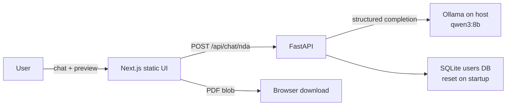

# Prelegal

Local-first application for drafting a Mutual Non-Disclosure Agreement (NDA) through an AI chat intake flow. Users answer questions in natural language; the app extracts structured fields, updates a live document preview, and exports a PDF when all required details are present.

Legal templates in this repository are based on [Common Paper](https://commonpaper.com/) standard agreements. **Today only Mutual NDA generation is implemented end-to-end.** Other templates are indexed for future use (see [Template catalog](#template-catalog)).

This software produces draft starting points. It is not legal advice. Have qualified counsel review any agreement before execution.

---

## Key features

- **Chat-based Mutual NDA intake** — conversational collection of party details, purpose, terms, governing law, and jurisdiction
- **Structured field extraction** — LiteLLM + local Ollama (`qwen3:8b`) with JSON structured outputs
- **Live preview** — side-by-side document preview that fills in as fields become known
- **Client-side PDF export** — download unlocks only when required fields are deterministically complete (not based on the model’s claim of completion)
- **Auth API foundation** — JWT register/login endpoints and a SQLite `users` table (not yet wired into the UI)
- **Single-origin Docker deploy** — Next.js static export served by FastAPI on port `8000`

---

## Architecture



**Request flow (NDA chat):** The frontend keeps an accumulated fields snapshot and the last few chat turns. Each turn posts both to `POST /api/chat/nda`. The backend merges newly extracted facts with the known snapshot and returns an updated snapshot plus a natural-language reply. Context is bounded (`RECENT_TURNS_LIMIT = 6`) so long conversations do not grow unbounded.

**Deployment shape:** A multi-stage Dockerfile builds the frontend (`output: "export"`), then runs the FastAPI app, which serves the static files from `/` and the API under `/api/*`.

---

## Tech stack

| Layer | Technology |
| --- | --- |
| Frontend | Next.js 16 (static export), React 19, TypeScript, Tailwind CSS v4, `@react-pdf/renderer` |
| Backend | FastAPI, Python 3.12, `uv`, PyJWT, bcrypt |
| AI | LiteLLM → local Ollama (`ollama/qwen3:8b`) |
| Database | SQLite (`users` table; recreated on every process start) |
| Packaging | Docker (multi-stage), platform start/stop scripts |

---

## Project structure

```text
pre-legal/
├── backend/                 # FastAPI app (uv project)
│   ├── app/
│   │   ├── main.py          # Auth routes, health, static mount
│   │   ├── chat.py          # POST /api/chat/nda
│   │   ├── auth.py          # JWT + password hashing
│   │   ├── database.py      # SQLite reset/create
│   │   └── schemas.py
│   └── tests/
├── frontend/                # Next.js UI
│   └── src/
│       ├── app/             # Page shell (chat + preview)
│       ├── components/      # ChatPanel, NdaPreview, NdaPdfDocument
│       └── lib/nda.ts       # NDA data model + completeness checks
├── templates/               # Common Paper Markdown templates (source material)
├── catalog.json             # Machine-readable template index
├── scripts/                 # Docker start/stop for macOS, Linux, Windows
└── Dockerfile
```

---

## How it works

1. User opens the Mutual NDA Creator UI and chats with the intake assistant.
2. Each message is sent with the current known fields; the model returns a reply and an updated field set.
3. The preview panel reflects known values immediately (with placeholders for missing ones).
4. When `isNdaFieldsComplete` is true, **Download PDF** is enabled and generates a PDF in the browser.

Wire format for the chat API uses flat field names (`party1CompanyName`, …). The UI converts to/from a nested `NdaFormData` shape at the API boundary—flat keys are more reliable for the local 8B model under structured-output constraints.

---

## Prerequisites

- [Docker](https://docs.docker.com/get-docker/) (recommended path)
- [Ollama](https://ollama.com/) running locally, with the model pulled:

```bash
ollama pull qwen3:8b
```

Ollama should listen at `http://localhost:11434` (default). The container reaches it via `host.docker.internal`.

For local (non-Docker) development you also need:

- Node.js 22+ (frontend)
- Python 3.12+ and [uv](https://docs.astral.sh/uv/) (backend)

---

## Quick start (Docker)

```bash
# macOS
./scripts/start-mac.sh

# Linux
./scripts/start-linux.sh

# Windows (PowerShell)
.\scripts\start-windows.ps1
```

Open **http://localhost:8000**.

Stop:

```bash
./scripts/stop-mac.sh      # or stop-linux.sh / stop-windows.ps1
```

Scripts build image `prelegal:latest`, run container `prelegal` on port `8000`, and add `host.docker.internal` so the app can call Ollama on the host.

---

## Local development

Run backend and frontend separately (useful for hot reload). Start Ollama first.

### Backend

```bash
cd backend
uv sync
uv run uvicorn app.main:app --reload --port 8000
```

### Frontend

```bash
cd frontend
npm install
npm run dev
```

The Next.js dev server (typically `http://localhost:3000`) calls the API at `http://localhost:8000`. CORS allows `http://localhost:3000`.

To exercise the static-export path used in Docker:

```bash
cd frontend && npm run build
# then run the backend with FRONTEND_DIST pointing at frontend/out
```

---

## Environment variables

There is no checked-in `.env.example`; configuration is via process environment (with defaults suitable for local use).

| Variable | Default | Purpose |
| --- | --- | --- |
| `OLLAMA_BASE_URL` | `http://localhost:11434` (host); `http://host.docker.internal:11434` in Docker | Ollama API base URL |
| `OLLAMA_CHAT_MODEL` | `ollama/qwen3:8b` | LiteLLM model id |
| `DB_PATH` | `backend/data/app.db` (or `/app/data/app.db` in Docker) | SQLite file path |
| `FRONTEND_DIST` | `frontend/out` relative to repo | Directory of static export to mount |
| `JWT_SECRET` | built-in dev secret | Signing key for access tokens |

**Note:** The SQLite database is deleted and recreated on every backend startup. Do not rely on it for durable user data.

---

## API

| Method | Path | Description |
| --- | --- | --- |
| `POST` | `/api/chat/nda` | NDA chat turn: `{ messages, fields }` → `{ reply, fields }` |
| `POST` | `/api/auth/register` | Create user; returns JWT (`email`, password min length 8) |
| `POST` | `/api/auth/login` | Login; returns JWT |
| `GET` | `/api/auth/me` | Current user (Bearer token) |
| `GET` | `/api/health` | Liveness check |

Chat is **unauthenticated** in the current UI. Auth endpoints exist for the technical foundation and are covered by tests, but the frontend does not yet implement login/register.

Example chat request body:

```json
{
  "messages": [{ "role": "user", "content": "My company is Acme Inc." }],
  "fields": {}
}
```

---

## Testing and linting

### Backend

```bash
cd backend
uv sync --group dev
uv run pytest
```

### Frontend

```bash
cd frontend
npm run lint
```

---

## Template catalog

[`catalog.json`](catalog.json) indexes Common Paper Markdown templates under [`templates/`](templates/), including Mutual NDA, CSA, DPA, SLA, PSA, BAA, Pilot, Partnership, Design Partner, Software License, and AI Addendum.

These files are reference/source material for the product roadmap. The running app does **not** yet select among them or generate documents other than the Mutual NDA (whose terms are represented in `frontend/src/lib/nda.ts` and rendered by the preview/PDF components).

---

## Design notes

- Inference is intentionally local-only (Ollama). Cloud LLM providers are out of scope unless explicitly added later.
- PDF generation happens in the browser; the server does not store drafts or documents.
- Download gating uses deterministic field completeness checks so an incomplete model reply cannot unlock export.
- Brand colors are defined as Tailwind theme tokens (accent yellow `#ecad0a`, primary blue `#209dd7`, submit purple `#753991`, navy `#032147`, gray `#888888`).

---

## Current limitations

- Only Mutual NDA chat + preview + PDF is productized; multi-document selection from `catalog.json` is not implemented.
- Auth API is present but unused by the UI; user sessions and document persistence are not implemented.
- SQLite is ephemeral (reset on startup).
- Local `qwen3:8b` can occasionally miss a fact stated in a message; restating it in a later turn usually recovers it.
- Frontend chat client hardcodes `API_BASE` to `http://localhost:8000` (fine for local Docker/dev; not yet configurable for other hosts).

---

## License

Application code: no root license file is present in this repository.

Legal templates in [`templates/`](templates/) are sourced from [Common Paper](https://github.com/CommonPaper) and licensed under [CC BY 4.0](https://creativecommons.org/licenses/by/4.0/). See [`templates/LICENSE.txt`](templates/LICENSE.txt).
